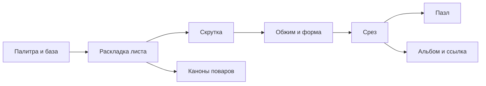

# Ролльня — карта

> Кладёшь начинки на плоский лист, скручиваешь и режешь. Узор на срезе нельзя нарисовать — он
> следует из раскладки, и увидеть его можно только после реза. Вся игра про это одно удивление.

## Стадия

| Состояние | Сколько | Что именно |
|---|---|---|
| Работает в игре | механик: 7 из 8 | роллов 6 · обёрток 5 · форм обжима 4 · фишек палитры 27 из 27 · уровней пазла 16 · альбом до 60 записей |
| Собрано, но не в игре | механик: 1 | Каноны поваров: 7 строк каталога (правила, готовые раскладки, порядок укладки) прогоняются сторожами и до игрока не доходит ни одна. Плюс 2 приёма выключены флагом в state.js — их просят 8 уровней из 16 |
| Описано, но недостижимо | начинок: 0 | Недостижимых начинок нет: игра даёт все 27 на любой базе. Ещё 5 красок и 2 инструмента рельефа лежат среди начинок, начинками не являясь |
| Задумано, кода нет | замыслов: 4 | заказ узора словом и атлас (ядро v0, #43), главы и симулятор, выбор нарезки игроком, мини-ролл |
| Не будет | — | очки, таймер, деньги и клиенты: ядро сознательно без них (docs/mechanics.md, кандидат C отклонён) |

Числа посчитаны прогоном самой модели при сборке этой заметки, а не переписаны руками.

## Как это устроено

Стрелка читается «что за чем»: слева то, что нужно раньше. Каждый узел кликабелен: провалиться можно в любой.

## Механики

- [[Палитра и база]] · **работает** — какой ролл крутим и во что заворачиваем: лист, постель, кусочки, страницы палитры.
- [[Раскладка листа]] · **работает** — единственный выбор игрока — куда на листе лечь фишке. Остальное выводится.
- [[Скрутка]] · **работает** — лист становится роллом: модель сама решает, кольцо это или спираль, и считает витки и шов.
- [[Обжим и форма]] · **работает** — тяга рукой и циновка: сила прижима и форма — круг, камабоко, квадрат, треугольник.
- [[Срез]] · **работает** — развёртка в круг: игра считает, какой материал лежит в каждой точке сечения.
- [[Пазл]] · **работает** — единственный игровой режим: показан срез, повтори раскладку. Порог 0,72.
- [[Альбом и ссылка]] · **работает** — ролл сохраняется рецептом, а не картинкой, и уезжает по ссылке.
- [[Каноны поваров]] · **собрано, но не в игре** — правила поваров, записанные исполняемо. Прогоняются сторожами, игроку не видны.

## Что осталось

- **Ядра игры нет.** Пазл — не решение, а единственный режим, который успели сделать; рекомендованное
  ядро v0 (заказ узора словом и атлас, `docs/mechanics.md`, #43) держится тем, что у узора нет имени:
  классификатор не написан. Это держит и [[Срез]], и всю «причину повторять».
- **Каноны стерегут молча.** [[Каноны поваров]]: 4 правила прогоняются сторожами и до игрока
  не доходят — подсказок на экране нет по решению 02.09, а пазл канон не читает и ведёт свою лестницу
  отдельно (#83). Держит обещание «игра учит канону» и лестницу [[Пазл]].
- **Замеры по `HYPOTHESIS.md` не начаты** — а от них зависит, подтверждается ли «хочется положить ещё
  и разрезать снова». Пока не подтверждено, лестница пазла и заказы стоят на догадке.

## Чего здесь нет

Хранилище — ВИД НА КОД: механики, каталог и решения про само блюдо. Всё остальное живёт снаружи.

- Задачи и дефекты — issues репозитория `newYurk/rollery`.
- Где мы сейчас и что дальше — `STATE.md`; хроника — `docs/journal.md`.
- Замысел и архитектура — `docs/design-core.md`, `docs/domain-contract.md`, ADR в `docs/decisions/`.
- Гипотеза и пороги замеров — `HYPOTHESIS.md`, `RESULT.md`.
- Сторожа — `play/checks.js`, `node tools/check.js`.

## Показ

Папка **Показ** — не каталог и не код. Три заметки, чтобы открыть хранилище и сразу сказать,
что это за игра: [[Как играется]], [[Чем красиво]], [[Обещание]]. Рядом [[Как смотреть граф]].
Генератор эту папку не трогает.

## Рисунки

Папка **Рисунки** — владельца: наброски механик от руки и правки поверх скриншотов (Excalidraw).
Генератор её не трогает; заметки 01–10 и эта карта, наоборот, **перезаписываются** при пересборке —
своё в них не дописывать. Рисовать поверх скриншота: вставить картинку в заметку в папке Рисунки,
поставить курсор на неё, ⌘P → «Excalidraw: Annotate image in Excalidraw». Рядом с рисунком сам
появляется `*.excalidraw.png` — его и читает агент.

---
Пересобрать: `python3 tools/obsidian-vault.py`. Схема выше — часть этой заметки, отдельной картинки
графа больше нет. Свои заметки клади в отдельную папку — генератор трогает только свои.
