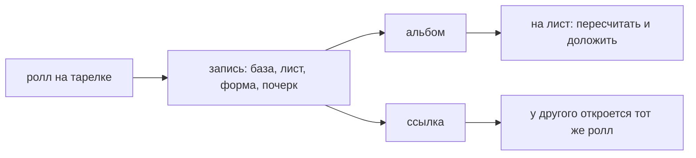

# Альбом и ссылка

> Собранный ролл сохраняется РЕЦЕПТОМ, а не картинкой: база, раскладка, форма, почерк. Поэтому запись можно открыть на лист, доложить начинку и скрутить заново, а ссылку — отдать другому.

**Состояние:** работает. Нужна: Срез

## Как работает

## Каталог этой механики

Своих строк каталога нет — механика работает над чужими.

## Чем ограничена

- Записей в альбоме — не больше **60**; лежат в хранилище браузера, на другое устройство не уезжают.
- Рецепт в ссылке не округляется — иначе у другого собрался бы другой ролл (#236).
- Витки ссылка несёт явно, и на входе они проходят то же правило «не короче двух витков».
- Ссылка открывает срез, не показывая раскладки: она же служит заданием пазла.

## Где в коде

`play/ui/album.js`: `albumSave`, `withRecipe`, `albumShare`; `play/modes/puzzle.js`: `encodePuzzle`.
