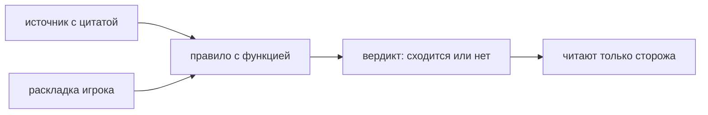

# Каноны поваров

> Правила настоящих поваров, записанные ИСПОЛНЯЕМО: не проза, а запись с функцией, которую можно прогнать на раскладке и спросить, сходится ли она с источником.

**Состояние:** собрано, но не в игре. Нужна: Раскладка листа

## Как работает

## Каталог этой механики

Строк: **7** · доходят до игрока: **0**.

- Канон: одна начинка в хосомаки — Хосомаки — одна начинка на ролл
- Канон: четыре роли футомаки — Футомаки собирается из четырёх РОЛЕЙ, а не из четырёх продуктов
- Канон: рассыпчатое дальше от себя — Рассыпчатое кладут ДАЛЬШЕ от себя, держащее форму — ближе
- Канон: сторона начинки — четверть постели — Сторона начинки — четверть ширины постели: тогда она окажется в центре
- Канон: будничный ряд из четырёх — будничная раскладка: по продукту на роль
- Канон: праздничный ряд из семи — праздничная раскладка: семь начинок
- Приём: порядок укладки — твёрдое ближе к себе, рассыпчатое дальше

## Чем ограничена

- **Игроку вердикт не показывается.** Это не забывчивость, а проверяемый факт: `canonCheck` зовут `checks.js` и не зовёт ни один файл игры (экраны, ввод, режимы).
- Подсказок на экране раскладки нет намеренно (решение владельца 02.09).
- Пазл канон не читает, хотя канон и есть готовая лестница сложности — правила написаны дважды (#83).
- Чего нет в источнике, того здесь нет: правило без источника в `canon.js` не кладут.

## Где в коде

`play/model/canon.js`: CANON, `canonCheck`, `canonSummary`, CANON_ROLES; зовут — `checks.js`.
