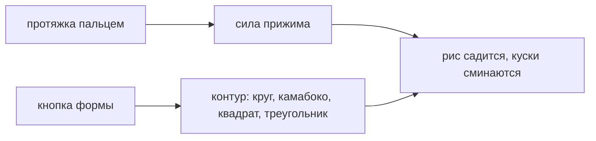

# Обжим и форма

> Тяга рукой и циновка: с какой силой сжали и в какую форму. Сила берётся из скорости протяжки, форма — кнопкой; вместе они решают, насколько сомнётся каждый кусок.

**Состояние:** работает. Нужна: Скрутка

## Как работает

## Каталог этой механики

Строк: **5** · доходят до игрока: **5**.

- форма **круг**
- форма **камабоко**
- форма **квадрат**
- форма **треугольник**
- Приём: обжим циновкой — встречная тяга, а не давление

## Чем ограничена

- Сжимается рис, а не обёртка: лист не тянется.
- Толстый кусок бугра не даёт — циновка вдавливает его, рис расступается (Решение: циновка вдавливает кусок).
- Форму держат только твёрдые куски; мягкие и длинные гнутся по витку (Решение: мягкое гнётся по витку).
- Воспроизводимость не обязательна: разброс идёт от руки игрока (решение владельца 25.08).
- Формы **квадрат** и **треугольник** просит пазл; **круг** и **камабоко** — только свободная игра.

## Где в коде

`play/model/geometry.js`: `жимЦиновки`, `squashOf`, `профильГраней`; `play/render/slice.js`: SHAPES; `play/ui/actions.js`: `measureHand`, ветка `shape`.
