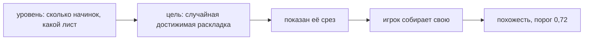

# Пазл

> Единственный игровой режим поверх модели: показан срез, повтори раскладку. Цель — не картинка, а раскладка, поэтому совпадение считается по координатам, а собирает игрок рукой.

**Состояние:** работает. Нужна: Срез

## Как работает

## Каталог этой механики

Строк: **16** · доходят до игрока: **8**.

- Пазл 01 — начинок 1, кусочков показано 1, лист 1,59 листа базы
- Пазл 02 — начинок 2, кусочков показано 1, лист 1,59 листа базы
- Пазл 03 — начинок 3, кусочков показано 1, лист 1,59 листа базы
- Пазл 04 — начинок 2, кусочков показано 1, лист 2,76 листа базы — ⚠ просит выключенное: обёртка куска и поворот куска
- Пазл 05 — начинок 3, кусочков показано 1, лист 0,74 листа базы
- Пазл 06 — начинок 3, кусочков показано 3, лист 1,59 листа базы
- Пазл 07 — начинок 4, кусочков показано 1, лист 2,76 листа базы
- Пазл 08 — начинок 3, кусочков показано 6, лист 1,59 листа базы
- Пазл 09 — начинок 3, кусочков показано 6, лист 1,59 листа базы — ⚠ просит выключенное: поворот куска
- Пазл 10 — начинок 3, кусочков показано 3, лист 2,76 листа базы — ⚠ просит выключенное: обёртка куска и поворот куска
- Пазл 11 — начинок 4, кусочков показано 6, лист 2,76 листа базы — ⚠ просит выключенное: обёртка куска
- Пазл 12 — начинок 4, кусочков показано 3, лист 0,74 листа базы — ⚠ просит выключенное: обёртка куска
- Пазл 13 — начинок 3, кусочков показано 1, лист 1,59 листа базы
- Пазл 14 — начинок 4, кусочков показано 1, лист 1,59 листа базы — ⚠ просит выключенное: обёртка куска
- Пазл 15 — начинок 4, кусочков показано 6, лист 1,59 листа базы — ⚠ просит выключенное: поворот куска
- Пазл 16 — начинок 5, кусочков показано 6, лист 2,76 листа базы — ⚠ просит выключенное: обёртка куска

## Чем ограничена

- Уровней **16**, порог совпадения **0,72**.
- **8 уровней из 16** (4, 9, 10, 11, 12, 14, 15, 16) просят приёмы, выключенные флагами в `state.js`: код жив, игрок их сделать не может.
- Лист уровня — СКОЛЬКО ЛИСТОВ БАЗЫ он берёт, а не витки и не доля (решение владельца 17.09): в миллиметрах у каждого ролла выходит своё.
- Цель никогда не берёт нори и волнистую пасту, а куски на голом крае бракует (#253).
- Канон пазл НЕ читает: лестница уровней задана своим списком, правила написаны дважды (#83).

## Где в коде

`play/modes/puzzle.js`: LEVELS, `genTarget`, `levelTurns`, PASS.
