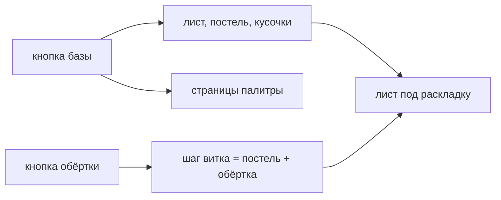

# Палитра и база

> Какой ролл крутим и во что заворачиваем. База задаёт длину листа, толщину постели, число кусочков и то, какие фишки вообще есть в палитре; обёртка входит в шаг витка и потому меняет диаметр.

**Состояние:** работает. Ни от чего не зависит — с неё всё начинается.

## Как работает

## Каталог этой механики

Строк: **11** · доходят до игрока: **11**.

- Ролл Хосомаки — лист 10.5 см, 6 кусочков, 13 фишек в палитре, намотку решает модель
- Ролл Тюмаки — лист 16 см, 8 кусочков, 16 фишек в палитре, намотку решает модель
- Ролл Футомаки — лист 21 см, 8 кусочков, 14 фишек в палитре, намотку решает модель
- Ролл Урамаки — лист 10.5 см, 6 кусочков, 13 фишек в палитре, намотку решает модель, рис снаружи
- Ролл Узумаки — лист 42 см, 8 кусочков, 12 фишек в палитре, спираль по самой базе
- Ролл Фруктовые — лист 21 см, 8 кусочков, 6 фишек в палитре, намотку решает модель
- Обёртка Нори — 0.1 мм, по умолчанию у: Хосомаки, Тюмаки, Футомаки, Урамаки
- Обёртка Рисовая бумага — 0.5 мм, по умолчанию у: ни у кого, берётся кнопкой
- Обёртка Соевая — 0.2 мм, по умолчанию у: ни у кого, берётся кнопкой
- Обёртка Омлет — 1.5 мм, по умолчанию у: Узумаки
- Обёртка Гюхи (моти) — 1.5 мм, по умолчанию у: Фруктовые

## Чем ограничена

- Ручного выбора намотки нет с 17.09: кольцо или спираль решает модель (Решение: намотку выбирает модель).
- Обёртку, на которой лежащий кусок не поместился бы на рис, перебор пропускает молча (#253).
- Смена базы не сбрасывает выбранную начинку, но уводит её на другую страницу палитры, если у новой базы прежней группы нет.
- Страниц палитры — **6**; базы в интерфейсе: **6** из **6** (полный интерфейс включён).

## Где в коде

`play/model/catalog.js` (BASES, WRAPPERS) · `play/state.js` (ING_GROUPS, uiPalette, palSync) · `play/ui/actions.js`, ветки `base` и `sheet`.
