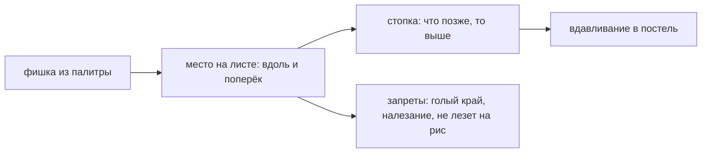

# Раскладка листа

> Единственное место, где выбор делает игрок: куда на листе лечь каждой фишке. Всё остальное игра выводит из этого — узор нельзя нарисовать, его можно только разложить.

**Состояние:** работает. Нужна: Палитра и база

## Как работает

## Каталог этой механики

Строк: **27** · доходят до игрока: **27**.

- Лосось — начинка, Нарезка брусок
- Огурец — начинка, Нарезка сектор
- Тамаго — начинка, Нарезка брусок
- Авокадо — начинка, Нарезка брусок
- Креветка — начинка, Нарезка полукруг
- Нори — начинка, Нарезка лист
- Майо — начинка, Нарезка паста
- Омлет — начинка, Нарезка лист
- Тунец — начинка, Нарезка брусок
- Шиитакэ — начинка, Нарезка брусок
- Кампё — начинка, Нарезка лист
- Анаго — начинка, Нарезка лист
- Дэмбу — краска постели, Нарезка присыпка
- Краб-палочка — начинка, Нарезка брусок
- Наруто — начинка, Нарезка кружок
- Грядка — инструмент рельефа постели, Нарезка присыпка
- Ложбинка — инструмент рельефа постели, Нарезка присыпка
- Розовый — краска постели, Нарезка присыпка
- Жёлтый — краска постели, Нарезка присыпка
- Зелёный — краска постели, Нарезка присыпка
- Чёрный — краска постели, Нарезка присыпка
- Клубника — начинка, Нарезка брусок
- Киви — начинка, Нарезка брусок
- Банан — начинка, Нарезка кружок
- Манго — начинка, Нарезка брусок
- Джем — начинка, Нарезка паста
- Орех — начинка, Нарезка кружок

## Чем ограничена

- Начинка лежит ТОЛЬКО вдоль оси ролла: диагонали нет (решение владельца 04.09, ADR-001-erratum-002, #168).
- Поворот куска — код жив, флаг `ROTATE_PIECE_ON` = false.
- Обернуть кусок в нори — код жив, флаг `WRAP_PIECE_ON` = false.
- На голый край листа положить нельзя — не подсказка, а невозможность: фишка не ложится (Решение: на голый край не кладут).
- Подсказок на экране раскладки нет намеренно (решение владельца 02.09).
- Из **27** строк палитры настоящих начинок — **20**; остальные это **5** красок постели и **2** инструмента рельефа, которые своего тела не имеют. Палитра одна на все базы: игра выдаёт все 27 на любой.

## Где в коде

`play/model/geometry.js` (restack, overlap, layFits, layOnRice) · `play/render/sheet.js` · `play/ui/actions.js` (onDown/onMove, ветки `rotate`, `wrap`, `remove`, `clear`, `undo`).
