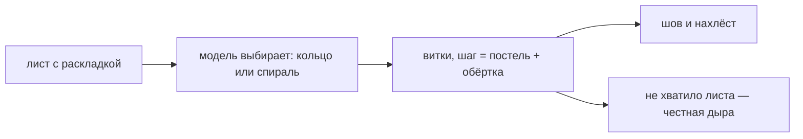

# Скрутка

> Плоский лист становится роллом. Модель сама решает, кольцо это или спираль, и считает витки, шов и нахлёст; хватило листа или нет — тоже считается, а не назначается.

**Состояние:** работает. Нужна: Раскладка листа

## Как работает

## Каталог этой механики

Строк: **5** · доходят до игрока: **5**.

- Приём: кольцо — лист один раз обхватывает рис, начинки собираются в ядро
- Приём: спираль — лист сворачивается сам на себя, ядра нет
- Приём: подворот и ядро — первый оборот: подъём и приземление кромки
- Приём: нахлёст и голые поля — клапан шва норисиро, ложится снаружи
- Приём: вывернутый ролл — рис снаружи, нори внутри (только Урамаки)

## Чем ограничена

- Намотку игрок не выбирает: кнопка снята 17.09, `S.winding` остался параметром модели для сторожей.
- В спирали длина нори в срезе равна длине листа (Решение: нори спирали равна листу).
- Лист короче двух витков не принимается — правило `acceptTurns` исполняют ссылка, альбом и уровень пазла.
- Не хватило листа обхватить начинку — нори обрывается и это сказано словами (Решение: честная дыра).

## Где в коде

`play/model/geometry.js`: `wind()`, `спиральПлан`, `conservativeBand`, `recipeTurns`; `play/model/util.js`: `acceptTurns`.
