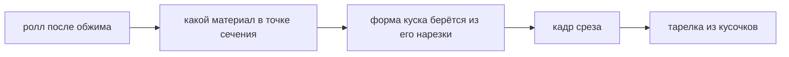

# Срез

> Ролл разворачивается в круг: игра считает, какой материал лежит в каждой точке сечения. Узор не рисуется и не хранится картинкой — он выводится заново из раскладки.

**Состояние:** работает. Нужна: Обжим и форма

## Как работает

## Каталог этой механики

Строк: **8** · доходят до игрока: **8**.

- Узор на срезе — развёртка листа: что положил, то и увидишь
- Нарезка брусок — видов: 9, достижимо: 9
- Нарезка кружок — видов: 3, достижимо: 3
- Нарезка полукруг — видов: 1, достижимо: 1
- Нарезка сектор — видов: 1, достижимо: 1
- Нарезка лист — видов: 4, достижимо: 4
- Нарезка паста — видов: 2, достижимо: 2
- Нарезка присыпка — видов: 7, достижимо: 7

## Чем ограничена

- Нарезку назначает каталог: выбора нарезки у игрока нет — Задумано, но ещё нигде.
- Пиксельный срез не зависит от истории рисования: один и тот же ролл даёт один и тот же кадр.
- Имени у узора нет: классификатор узоров (кольцо, дуга, глаз, обёрнутый) описан в `docs/mechanics.md` как кандидат E и не написан.
- Кусочков на тарелке — от 6 до 8, число берёт база.

## Где в коде

`play/render/slice.js`: `renderSection`, `face`; `play/model/geometry.js`: `matAt`, `cutProfile`, `conservativeBandMaterial`.
