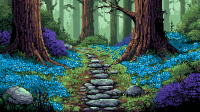
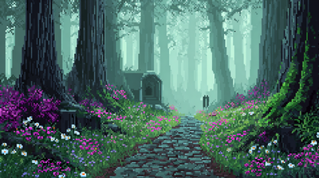
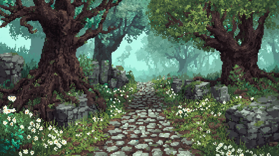

# Мудборд: как «Ролльня» хочет выглядеть

Обновлено 02.09.2026.

Здесь лежит то, что владельцу **понравилось глазами**, и разбор — почему понравилось и что
из этого переносимо. Не каталог референсов «на всякий случай»: попало сюда только то, на что
был отдельный отклик.

---

## 1. Лесные сцены, 02.09.2026

Владелец: «Мне очень понравился вот этот стиль… прям вообще очень круто. Может быть, на
заставке или где-то такого типа будет».

### Как это называется

**Единого канонического имени у стиля нет** — и это честный ответ, а не уклончивый. Ближе
всего три названия, и каждое про свою грань:

| название | про что оно |
|---|---|
| **painterly pixel art** | живописный подход внутри пиксельной сетки: не плоская заливка, а растяжки, дизеринг, воздушная дымка |
| **ドット絵 (дот-э)** | японское слово для пиксельной графики вообще, безоценочное |
| **16-bit JRPG background** | эпоха-ориентир: фоны SNES-ролевых игр — Secret of Mana / Seiken Densetsu 3, Chrono Trigger, Terranigma |

Если нужно одно слово для разговора с художником — **painterly pixel art**, и дальше
показывать эти три кадра.

### ⚠ Что показал замер, а не глаз

Прежде чем называть это «шестнадцатибитным», я померила файлы:

| | |
|---|---|
| размер | 400 × 224 |
| цветов | 48 500 … 65 200 |
| цветов при 15-битной палитре SNES | 2 500 … 4 900 (на экране SNES допускал **256**) |
| доля горизонтальных серий длиной 1 px | **97–99 %** |

Последняя строка решает всё. В настоящем пиксель-арте большие **плоские** области, и серии
длинные. Здесь почти каждый соседний пиксель отличается от предыдущего — то есть перед нами
не пиксель-арт, а **живописная картинка в низком разрешении**. Пиксельность читается из-за
малого размера и высокочастотного шума, а не из-за сетки и палитры.

Это ровно та беда, что уже записана в `tools/pixel-icons.py`: «модель рисует КАРТИНКУ,
ПОХОЖУЮ на пиксель-арт: пиксели у неё неровные, с переходными оттенками и сглаженными
краями». Поэтому кадры выше — **референс настроения, а не технический образец**. Скопировать
их «как есть» нельзя: получится мыло, а не арт.

### ⚑ Решение владельца 02.09: шестнадцать бит не обязательны

«Может быть, не обязательно шестнадцатибитной. Мне вот просто пиксельный нравится арт».

То есть ограничения эпохи (256 цветов на экране, тайлы 8×8, четыре палитры на спрайт)
**на нас не распространяются**. Держать надо не эпоху, а сам приём: видимая сетка, честные
плоские области, осознанные цвета. Разрешение и размер палитры выбираются под задачу.

### Что из этих кадров переносимо

Разложено по приёмам, а не по впечатлению, — чтобы этим можно было пользоваться:

1. **Воздушная перспектива.** Дальний план обесцвечивается И уходит в цвет дымки (здесь —
   зелёно-бирюзовый), а не просто светлеет. Это главный источник глубины на всех трёх кадрах.
2. **Один холодный фон, один тёплый акцент.** Стволы тёплые, всё остальное холодное. Цветы
   (синие, розовые, белые) — единственное насыщенное пятно, и его немного.
3. **Тропа как ось взгляда.** Уводит вглубь и делит кадр; камни на ней — единственная
   правильная геометрия среди органики, и потому читаются как рукотворное.
4. **Тёмная рама по краям.** Стволы у левого и правого края замыкают кадр и не дают взгляду
   уйти вбок.
5. **Плотность деталей вместо разрешения.** Мелочи (листья, лепестки) не прорисованы, а
   набраны точками — на 400 px этого достаточно.

### Где это может пригодиться в «Ролльне»

- **Заставка** и фон меню — прямое попадание.
- **Фон стола** под циновкой: сейчас там почти чёрное поле. Осторожно: срез обязан оставаться
  читаемым, и любой рисунок за ним конкурирует с ним за внимание.
- **Экран альбома** — витрина сохранённых роллов просится в такую подачу.

**Куда НЕ переносить: сам срез.** Срез — вид сверху, техническая проекция, и его задача —
показать узор от раскладки. Живописность там мешает: владелец уже трижды ловила дефекты
именно на срезе, и чем он чище, тем это проще.

### Что не сходится с нынешним видом

Стенд сейчас — почти чёрный фон и предметы 40 × 40 на нём. Кадры выше — цельная сцена
400 × 224 с глубиной. Это два разных языка, и просто положить одно на другое не выйдет:
либо сцена уходит далеко на задний план и сильно приглушается, либо меняется вся подача.
Решение не принято.

---

## Как пополнять

Класть сюда только то, на что был **отклик владельца**, и рядом — разбор приёмов, а не
эпитеты. Картинки — в `docs/moodboard/`, лёгкие (сотни килобайт), потому что на них
ссылается этот действующий документ. Отработанные пробы стиля сюда не складывать: им место
во временных папках вне git.
